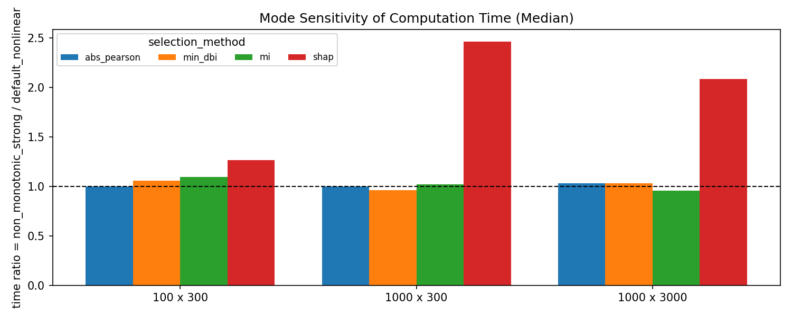

# Result Discussion (2026-03-07, updated)

분석 데이터:
- `result.csv` (현재 120행: `3 settings x 5 seeds x 2 relationship modes x 4 methods`)
- relationship mode:
  - `default_nonlinear`
  - `non_monotonic_strong`

실행 환경(시간 측정 기준):
- CPU: `Intel(R) Core(TM) Ultra 7 155H` (16 cores, 22 logical processors, max 3.8GHz)
- RAM: 총 `31.59 GiB` (측정 시점 가용 `17.11 GiB`, 사용률 약 `45.8%`)
- 전원 모드: `SAMSUNG MODE` (`powercfg /getactivescheme`)
- 동시작업수(벤치마크 프로세스): `1` (단일 실험 프로세스 기준, dataset/selector 병렬 실행 없음)

## 1) 시간 스케일이 예측과 일치하는지

`time_bar.png`(mode 통합 집계, `median_iqr`) 기준 중앙값:

| shape | abs_pearson | min_dbi | mi | shap |
|---|---:|---:|---:|---:|
| 100 x 300 | 0.0200 | 0.0690 | 0.1565 | 0.4920 |
| 1000 x 300 | 0.0240 | 0.1090 | 0.8000 | 48.0915 |
| 1000 x 3000 | 0.3605 | 1.6355 | 12.1720 | 77.6535 |

해석:
- 시간 순서는 일관적으로 `abs_pearson < min_dbi < mi < shap`.
- `N`(rows), `P`(features)가 커질수록 계산 시간이 증가.
- `shap`은 분산(IQR)이 상대적으로 커서, 동일 shape에서도 런타임 변동이 큰 편.

## 2) 비선형성 추가 후 정답률 비교

정답 기준: `selected_feature == the_ground_truth`

mode별 정답률:

| relationship_mode | abs_pearson | min_dbi | mi | shap |
|---|---:|---:|---:|---:|
| default_nonlinear | 1.000 | 0.800 | 1.000 | 1.000 |
| non_monotonic_strong | 0.133 | 0.933 | 1.000 | 0.800 |

전체(두 mode 통합) 정답률:

| method | correct / total | hit rate |
|---|---:|---:|
| abs_pearson | 17 / 30 | 0.567 |
| min_dbi | 26 / 30 | 0.867 |
| mi | 30 / 30 | 1.000 |
| shap | 27 / 30 | 0.900 |

핵심 관찰:
- `non_monotonic_strong`에서 `abs_pearson` 성능이 크게 하락(1.000 -> 0.133).
- `mi`는 두 mode 모두 1.000으로 안정적.
- `shap`은 비선형 모드에서 하락(1.000 -> 0.800)하지만 correlation 기반보다는 강건.

## 3) 계산 시간이 mode에 거의 영향받지 않는 이유 (+ 그림)

대부분 방법에서 시간 복잡도를 지배하는 것은 관계식 모양보다 `N`, `P`, 반복 횟수다.
- `abs_pearson`: 후보 feature별 상관계수 반복 계산
- `min_dbi`: 후보 feature별 DBI 계산 반복
- `mi`: 후보 feature별 MI 추정 반복

그래서 관계식을 바꿔도 위 3개는 동일 shape에서 시간이 거의 비슷하다.  
반면 `shap`은 내부 모델 학습/설명 단계가 포함되어, 타깃 함수 난이도 변화에 더 민감하다.

shape별 `non_monotonic_strong / default_nonlinear` 시간비(중앙값):

| shape | abs_pearson | min_dbi | mi | shap |
|---|---:|---:|---:|---:|
| 100 x 300 | 1.000 | 1.060 | 1.097 | 1.263 |
| 1000 x 300 | 1.000 | 0.964 | 1.022 | 2.461 |
| 1000 x 3000 | 1.031 | 1.033 | 0.958 | 2.084 |

그림(mode별 시간 민감도 ratio):

## 4) 10,000 x 20,000 예상 CPU time (업데이트)

관측된 3개 shape에서 power-law(`time ~= k * rows^a * features^b`)로 추정.

mode 통합 기준 예상치:

| method | predicted time (sec) | approx |
|---|---:|---:|
| abs_pearson | 4.03 | ~0.07 min |
| min_dbi | 24.06 | ~0.40 min |
| mi | 586.17 | ~9.77 min |
| shap | 11264.55 | ~187.7 min |

mode별 참고(특히 SHAP):
- `default_nonlinear`: `shap ~6073 sec` (~101.2 min)
- `non_monotonic_strong`: `shap ~21496 sec` (~358.3 min)

## 5) 추가 해석: 왜 MI가 SHAP보다 정확했고, 왜 SHAP 시간이 더 흔들리는가

### 5-1) MI가 SHAP보다 정확도가 높게 나온 가능한 이유

- 현재 데이터 생성에서는 `the_most_relevant`가 `target`의 직접 비선형 함수로 정의되어, "한 변수와 타깃의 직접 의존성"이 매우 강하다.
- `mi`는 각 후보와 타깃의 쌍별 의존성을 직접 점수화하므로, 이런 구조에서 top-1 식별이 유리하다.
- `shap`은 랜덤포레스트 예측모델을 먼저 학습한 뒤 중요도를 계산한다. 후보 간 상관(클러스터 latent 공유, config 효과)이 있으면 중요도가 유사 후보들로 분산될 수 있어 top-1 정확도가 떨어질 수 있다.
- 즉 본 결과의 해석은 "이 프로토콜 구조에서는 MI가 더 유리했다"이며, 일반적으로 항상 MI > SHAP를 의미하지는 않는다.

### 5-2) SHAP 시간이 mode에 따라 더 크게 변하는 이유

- 이번 구현의 SHAP 시간에는 모델 학습(`RandomForestRegressor.fit`)과 설명 계산(`TreeExplainer.shap_values`)이 모두 포함된다.
- `non_monotonic_strong`처럼 더 복잡한 함수에서는 트리가 더 깊어지는 경향이 있어, 설명 계산 경로가 길어지고 전체 시간이 증가할 수 있다.
- 간단 진단(1000 x 300, seed=0, 동일 파라미터) 결과:

| mode | RF fit (sec) | SHAP explain (sec) | total (sec) | avg tree depth |
|---|---:|---:|---:|---:|
| default_nonlinear | 1.41 | 23.95 | 25.36 | 18.48 |
| non_monotonic_strong | 2.08 | 76.24 | 78.32 | 26.62 |

- 위 진단은 "모델 생성 + 설명 계산 비용"이 함수 복잡도에 따라 크게 달라질 수 있음을 뒷받침한다.  
  따라서 SHAP 시간 변동은 단순 노이즈라기보다, 모델 복잡도 변화의 영향으로 보는 것이 타당하다.

결론:
- 정확도: 본 실험 구성에서는 MI가 가장 안정적으로 정답 feature를 찾았고, SHAP은 그 다음으로 강건했다.
- 시간: `abs_pearson/min_dbi/mi`는 주로 shape 영향, SHAP은 shape + 함수 복잡도(모드) 영향이 함께 크게 작동한다.
